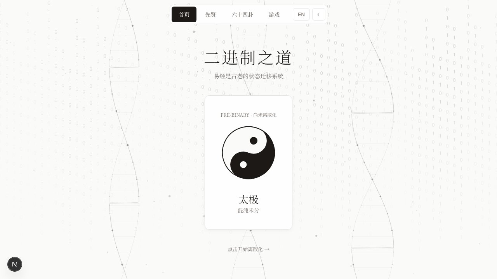
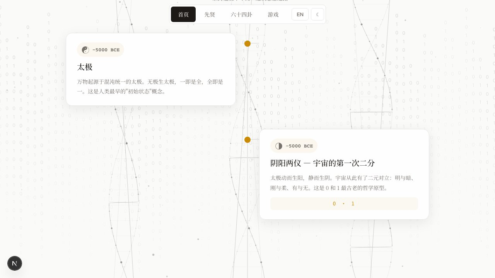
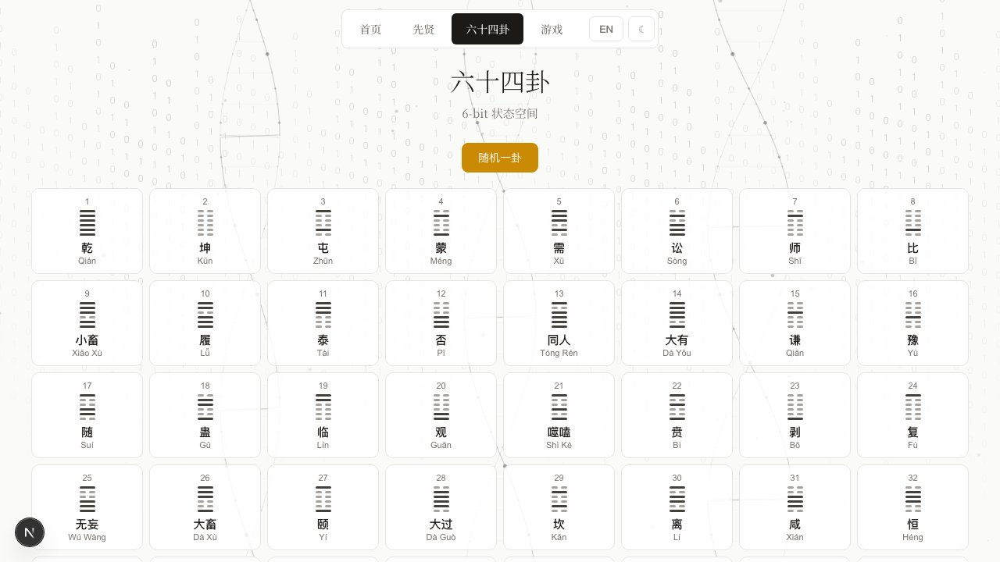
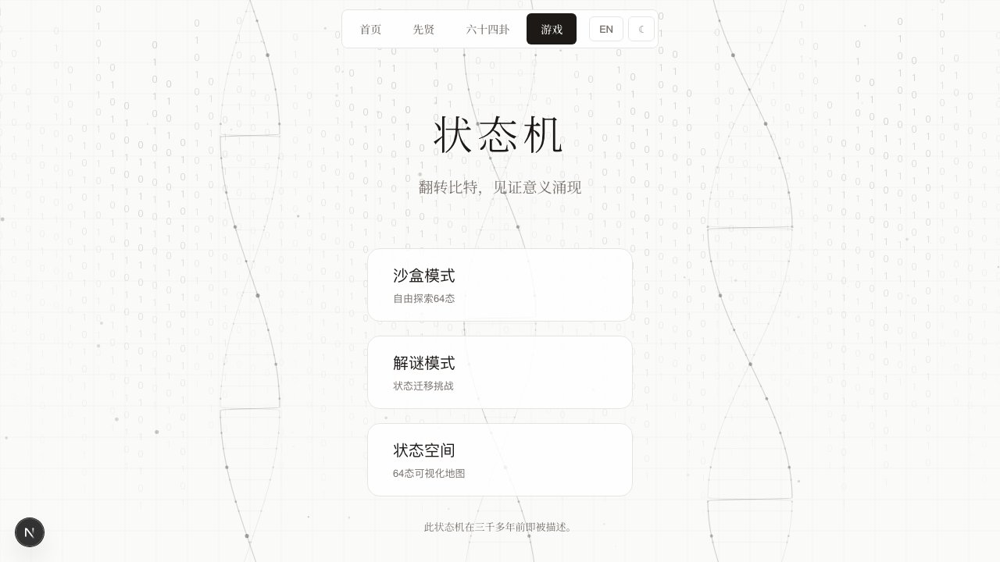

<div align="center">

# ☯ 二进制之道 · The Tao of Binary

### 万物的源代码 / The Source Code of Everything

<br/>

**[🔗 Live Demo](https://binary-8zzxanay5-chlwu0777s-projects.vercel.app)**

<br/>

 
 

</div>

<br/>

> **阳爻 = 1，阴爻 = 0。八卦 = 3-bit 编码（2³ = 8），六十四卦 = 完整的 6-bit 状态空间（2⁶ = 64）。**
>
> Yang line = 1, Yin line = 0. Trigrams = 3-bit. 64 Hexagrams = complete 6-bit state space.

---

## Features

| | |
|---|---|
| **☯ 太极交互** | 点击太极，亲眼见证"一分为二"的离散化过程 |
| **📜 先贤长廊** | 8 位先贤：伏羲 → 莱布尼茨 → 荣格，五千年知识接力 |
| **🔢 六十四卦** | 8×8 交互网格，逐爻解读，悬停查看爻辞 |
| **🎮 游戏模式** | 沙盒 · 解谜 · 探索——用二进制思维破关 |
| **🕰️ 时间轴** | 从太极到计算机，8 个里程碑随滚动浮现 |
| **🌙 日/夜模式** | 水墨宣纸（日间）↔ 深色墨金（夜间） |
| **🌐 中/英切换** | 全站 100+ 条文案实时切换 |

---

## Quick Start

```bash
git clone https://github.com/chlwu0777/yinyang-binary.git
cd yinyang-binary
npm install
npm run dev
```

Open **http://localhost:3000**

---

## Timeline

```
~5000 BCE    太极 Taiji ................... The Undifferentiated
~5000 BCE    阴阳 Yin-Yang ............... The First Binary Split → 0 and 1
~3000 BCE    伏羲八卦 Trigrams ........... 3-bit encoding system
~1050 BCE    文王六十四卦 Hexagrams ...... 6-bit state space (2⁶ = 64)
 1011-1077   邵雍 Shao Yong .............. Doubling method, 600 years before Leibniz
 1703        莱布尼茨 Leibniz ............ Discovered I Ching = Binary
 1854        布尔 Boole .................. Logic becomes 0 and 1
 1945+       现代计算机 Computer ......... Yao lines become silicon circuits
```

---

## Tech Stack

**Next.js 16** · **React 19** · **TypeScript** · **Canvas API** · **Zero dependencies**

---

## Quotables

> "八卦不是迷信。它是 3-bit 编码，比计算机早了五千年。"
> *The trigrams aren't superstition. They are 3-bit encoding, 5,000 years before the computer.*

> "莱布尼茨没有发明二进制。他重新发现了它。"
> *Leibniz didn't invent binary. He rediscovered it.*

---

<div align="center">

**☯ → 01**

*The story of 0 and 1 spans five millennia.*

**[🔗 Live Demo](https://binary-8zzxanay5-chlwu0777s-projects.vercel.app)** · **[📖 Brand Narrative](./binary-tao-brand-narrative.md)**

</div>
